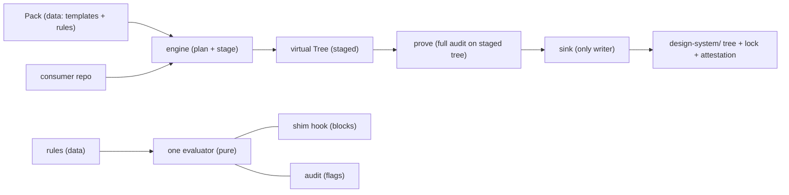

# Architecture

<!-- Coarse by design. If a sentence would go stale when a file is renamed, it doesn't belong here. -->

*2026-06-11 — greenfield build spec, synthesized from the field teardowns (`teardowns.md`) and the two prior drafts it supersedes. Once code exists, this doc describes the machine as built; anything still aspirational moves to ADRs. Deferred work lives in its own section at the bottom with explicit entry conditions — it is not scope.*

## Bird's Eye View

claude-ds is a CLI that installs a governed design-system scaffold into consumer projects and keeps it converged across releases. It takes a consumer repo plus a versioned **Pack** and produces a clean, mechanically-enforced `design-system/` tree — then proves the tree stayed clean every time it runs.

Two core insights:

1. **Governance is enforcement, not documentation.** Conventions in prose drift the moment an AI agent (or a human) writes a file. Every constraint exists in executable form or it isn't a convention yet — it's a wish.
2. **Guarantees hold by construction, not by discipline.** Atomicity, single-writer, and hook/audit parity are not invariants something must police — they are violations the architecture cannot express. Writes can only happen through one sink; the hook and the audit can only run identical rule data; a failed run can only leave the tree untouched. These are nearly free to build correctly on day one and miserable to retrofit, which is why they are day-one scope.

Four moving parts:

1. **Packs** — pure, versioned, content-addressed data: templates, a manifest declaring how every file is owned, and declarative rules (matchers + rationale + remedy — no code). Migrations are the one executable surface a Pack carries.
2. **The engine** — derives state, plans remediation, transforms an in-memory **Tree**, and replays staged actions onto disk through a single sink — or nothing happens at all.
3. **Consumer-side machinery** — deliberately tiny: one shim hook dispatcher, a CI drift check, and the materialized `design-system/` tree itself.
4. **The ledger and the lock** — the consumer-committed record of what is owned (manifest), what is exempt (baseline + waivers, one ledger), which Pack is pinned (content hash), and what the last run proved (attestation).

Data flows one direction: pack + consumer tree → findings → plan → staged Tree → proven → committed to disk. Nothing writes outside that last arrow, because nothing else *can* write.

## Core Vocabulary

- **Pack** — a versioned, content-addressed artifact: templates + tokens + rules + migrations + zone declarations. The only source of truth; the consumer repo holds a materialization, never the truth itself.
- **Materialization** — the on-disk `design-system/` tree produced from a Pack.
- **Zone** — every governed path belongs to exactly one ownership zone, declared by the Pack: the **pack zone** (regenerated wholesale, never hand-edited) or the **consumer zone** (designated extension seams, never overwritten by the engine).
- **Rule** — a declarative constraint shipped in the Pack: matchers (with capture groups for relative rules like "tiers import only downward"), a rationale, and a machine-readable remedy. No code.
- **Finding** — a structured rule violation: rule id, path, evidence, remedy.
- **Tree** — an immutable in-memory snapshot of a file tree plus a staged action list (create/overwrite/rename/delete). The only thing rules and operations ever see.
- **Sink** — the only code holding a filesystem write handle. The dry-run sink validates and reports; the host sink replays staged actions atomically after the proof passes.
- **Baseline** — pre-existing violations snapshotted at adopt time: visible, reported, non-failing, expected to burn down. Anything *new* fails immediately.
- **Waiver** — a ledgered, expiring exemption from a rule. Baseline entries and waivers share one ledger; a baseline entry is structurally a waiver auto-stamped at adopt. The only legal ways to not comply.
- **Lock** — pins the installed Pack by content hash and records the hash of every governed file.
- **Attestation** — the output of a run: Pack hash, tree hash, rule-set version, verdict, every active waiver and baseline entry.

## Entry Points

One binary, `claude-ds`, with subcommands. To trace any behavior, start at CLI dispatch and follow one of:

- `claude-ds install` — first materialization into a clean repo (also registers the hook shim).
- `claude-ds adopt` — install into an existing repo: materialize, then snapshot every pre-existing violation into the baseline.
- `claude-ds converge` — move the materialization to a new Pack version. The most interesting path; traced in full under Data Flow.
- `claude-ds audit` — recompute the verdict from disk. The CI entry point; exit code is the verdict.
- `claude-ds restore` — regenerate the pack zone from the pinned Pack (the fix for pack-zone drift).
- **The shim hook** — the one file Claude Code (PreToolUse) and git (pre-commit) invoke inside consumer repos. It does nothing but marshal the proposed write into the engine.

## Code Map

### `cli/`

Command parsing and dispatch only. Thin by rule: each command delegates to the engine or an enforcement surface. Separate so the entire system stays drivable programmatically — the shim and the tests call the same internals the CLI does.

**Invariant:** `cli/` contains no rule logic and no file mutation.

### `pack/`

Pack format: loading, content-hash verification, version resolution, and the schema for what a Pack may contain. Separate because Packs are the trust boundary — everything downstream assumes a verified Pack, and that assumption is established only here.

**Invariant:** `pack/` never reads the consumer repo. A pack that fails hash verification is never loaded.

### `tree/`

The virtual Tree and its sinks. A Tree can be built from disk (audit), from disk-plus-one-hypothetical-write (hook), or staged toward a future state (converge). Operations are Tree→Tree transforms. Two sinks: dry-run (validate + report — this *is* the `--dry-run` output, same code path) and host (replay onto disk, atomically, only after the staged tree passes the full audit). Separate because it is the seam that makes the evaluator pure, the three contexts interchangeable, and the write boundary structural.

**Invariant:** nothing outside the sinks holds a filesystem write handle.

### `rules/`

The rule schema and the one evaluator: a pure function from (rule set, Tree snapshot) → findings. Expensive derivations (cycles, reachability) compute only when a rule demands them. Separate — and kept pure — because both enforcement surfaces wrap it; purity over a snapshot is what guarantees a write the hook would block is always a write the audit would flag, and vice versa.

**Invariant:** `rules/` imports nothing from `enforce/` or `engine/` and performs no I/O.

### `enforce/`

The two surfaces, `enforce/hook/` and `enforce/audit/`, each a thin adapter around the evaluator. The hook builds a hypothetical snapshot and translates findings into a block-with-remedy. The audit builds a snapshot from disk, classifies drift (pack-zone edit, consumer-zone violation, unknown file), and emits the attestation. Separate from `rules/` so the evaluator stays ignorant of how it is being used.

### `engine/`

The pipeline: derive state, plan (every finding kind maps to exactly one owning step, in one canonical order), stage onto the Tree, prove, hand to the sink. The only module that sees both a Pack and the consumer repo at once. Separate because concentrating orchestration in one place is what keeps `cli/` thin and the planner singular — two brains diverge.

**Invariant:** every mutating operation ends with a full audit of the staged tree before the sink runs; a dirty verdict on the engine's own output is a crash-level bug, never a finding.

### `state/`

Lock and the exception ledger (waivers + baseline): read, write, verify. Separate from `pack/` deliberately — the lock describes *this repo's* installed state, the Pack describes *the truth*; conflating them is how tools end up trusting their own history.

**Invariant:** `state/` never reads Packs.

### `report/`

Findings formatting, attestation emission, and the agent-feedback contract: structured JSON with remedy fields, plus a human rendering. Separate so every command speaks one output language and agents can parse anything a human can read.

## Design Decisions

### By construction over by discipline

The meta-decision the rest follow from. Where there are two ways to hold a guarantee — police it (meta-test, code review, convention) or make it inexpressible (one sink, rules-as-data, pure evaluator) — take the second every time. Why: the primary author in governed repos is an AI agent, and the governor itself is increasingly agent-maintained; discipline does not survive that, structure does. The field's strongest tools (Angular's virtual Tree, dependency-cruiser's rule engine, projen's manifest) all share this property. Greenfield is when it's cheap: the teardowns' single biggest defect finding in the prior system was write-as-you-go mutation, a retrofit problem this design never has.

### Rules are data; the engine is the only code

A blocking hook and a flagging audit implemented twice will drift apart — the original disease, one level up. The fix is not sharing code, it's having no code to share: rules are declarative matchers in the Pack, evaluated by one engine. Capture-group relative rules (dependency-cruiser) collapse the per-tier rule list to a handful of entries. Each rule carries its own rationale and remedy, so enforcement teaches. Any human- or agent-facing prose about the conventions is *generated from the rules* and marked as generated — if docs were hand-written, the docs and the enforcement would become two sources of truth, and the doc would lose.

### Stage, prove, commit — as one mechanism, not three promises

All mutation is a Tree transform; the host sink replays staged actions only after the full audit passes on the staged tree with the *target* rule set. Why: the tool whose job is "never leave the tree dirty" must be structurally incapable of doing so halfway through its own failure. Angular proved this shape at ecosystem scale. The free dry-run and exact-bytes preview are consequences, not features.

### Ownership zones over merge cleverness

Pack-zone files are replaced wholesale on upgrade; consumer customization happens only at seams the Pack explicitly declares. There is no three-way merge of generated code, and in v1 no merge of anything. Why: merging is where every scaffold tool rots (shadcn's deprecated `diff` is the cautionary tale; cruft died on conflict UX). A hard ownership boundary is cruder and strictly more survivable. A hand-edit inside the pack zone is not a merge input, it's drift, and the fix is `restore`. The field shows a known-good hybrid-merge algorithm exists (copier); it is deliberately deferred, not rejected — see Deferred.

### Always block; the baseline absorbs the past

There is no warn mode. Enforcement always blocks — but `adopt` snapshots every pre-existing violation into the baseline: visible, reported, non-failing, burning down over time, while anything new fails immediately. Why: a warn/block mode split is enforcement nobody wires correctly (the prior system shipped exactly that defect — hooks that ignored the mode flag); baseline-vs-new is the brownfield story that actually works (dependency-cruiser). One ledger, two entry routes (human-granted waiver, adopt-stamped baseline), every entry with rule id, scope, owner, and expiry, all surfaced in every attestation.

### Waivers are ledgered, never inline

No ignore-comments, ever. Why: inline ignores are invisible in aggregate, never expire, and an AI agent will happily add one to make an error go away. A ledger makes the cost of non-compliance visible and finite.

### Clean tree or no mutation

Every mutating command refuses to run on a dirty git tree (`--allow-dirty` to override). Why (Angular, copier): the cheapest safety rail in the field — recovery from anything is `git reset` — and it costs one check.

### Autoblockers gate before migrations run

Unsupported runtime, multi-major version jumps, and other can't-proceed conditions are a separate pre-mutation gate, not migration failures. Why (Storybook): a blocked precondition is not a finding and not a migration bug; mixing them teaches agents to "fix" the wrong thing.

### Migrations travel with the Pack, idempotent, doubling as repair

Consumers pin a Pack by content hash and move forward through idempotent, version-keyed migrations — never by chasing `main`. Re-running migrations verifies end-states; a regressed end-state is a repair, not an upgrade. Why: the author of a change is the only party who knows mechanically what it means; idempotence makes the verification chain the real mechanism — version keys are just ordering. Storybook and copier independently arrived at the same shape. Migrations are written as Tree transforms, not arbitrary shell — this is what keeps dry-run honest (copier suppresses its own dry-run on update because side-effectful replay would lie; this design refuses the side effects instead).

### Deletions are opt-out; pack-zone files are the exception

A consumer-deleted seeded or extension-seam file is an intentional decision and is never resurrected. Pack-zone files *are* resurrected — the manifest says they must exist, and their absence is drift, not preference. Why: copier and cruft both converged on deletion-as-opt-out; the pack-zone exception is what "pack-owned" means. Stated here so it is a decision, not an accident.

### One shim in the consumer tree

Consumer-side enforcement is a single tiny managed dispatcher — invoked by Claude Code hooks and git, marshalling every event into the engine — not a per-hook script surface. Why (Husky): every grafted file is surface synced forever; one shim plus rules-as-data shrinks ten synced hooks to one, and the shim absorbs all runtime concerns (opt-out env var, PATH, diagnostics) so it almost never changes.

### Stateless verdicts, pinned inputs

`audit` recomputes everything from disk against the hash-verified Pack. No cached verdicts, no "was clean last time." Why: a proof that trusts the previous proof is a chain of custody, not a proof.

### No silent defaults

Genuine project judgments surface as structured Decisions — prompted on a TTY, answered from a committed answers file headlessly, or failed loudly. Never guessed inside planning. Why: an agent silently making the consumer's decisions is worse than stopping.

### The materialization has no runtime dependency on claude-ds

Uninstall the CLI; the tree still builds, type-checks, ships. claude-ds is a governor, not a framework. Why: coupling the consumer's build to the governance tool makes every claude-ds bug a consumer outage and adoption a one-way door. Governance you can leave is governance teams will accept (projen's `eject`).

### Agent-first error contract

Every block and finding carries the rule that fired, why (the rule's own rationale travels with it), and the compliant alternative. User-facing errors are classes with stable codes and docs anchors (Storybook). Why: enforcement that only says "no" makes agents thrash — retrying variations until something slips through; enforcement that teaches converges in one round trip. Humans get the same content rendered readably — one contract, two renderings.

### Deliberately not built

No prop playgrounds, no generated prop tables, no story files — anything that can go stale independently of code. No opinion on whether a button is pretty: claude-ds governs trees. The command surface is pinned by snapshot test; growing it is an ADR.

## Data Flow: `claude-ds converge` end to end

1. **Gate** — clean git tree (or `--allow-dirty`); autoblockers; both the pinned and target Packs hash-verified before anything else happens.
2. **Pre-flight** — audit the live tree against the *current* Pack. Already dirty → stop and report; a migration applied to an unknown base produces an unknown result. The consumer fixes findings (or `restore`s the pack zone) and re-runs.
3. **Plan** — diff current materialization against the target Pack: pack-zone files to replace, the ordered migration chain, consumer-zone files to re-judge under the target rule set. The plan is printed before anything is staged.
4. **Stage** — build the future tree on the virtual Tree: replace the pack zone, run migrations as Tree transforms, leave everything else untouched. No disk I/O.
5. **Prove** — run the full audit against the staged tree with the target rules. Findings here mean the migration itself is insufficient — the run fails with the findings, and the live tree is never touched.
6. **Commit** — the host sink replays the staged actions atomically. Write the new lock (target Pack hash, fresh file hashes) and emit the attestation, including every active waiver and baseline entry.
7. **Idempotence (implicit)** — running `converge` again immediately produces an empty plan. A non-empty second plan is a claude-ds bug, not a state of the world.

`install` is steps 3–6 with an empty base; `adopt` is `install` plus baseline-stamping at step 6; `audit` is step 2 alone; `restore` is steps 4–6 restricted to the pack zone. The hook path is the miniature: proposed write → shim → evaluator on snapshot-plus-hypothetical-write → block-with-remedy or allow. No disk writes, by construction.

## Cross-Cutting Concerns

### Testing

The backbone is **golden-repo fixtures**: pristine consumer repos paired with Packs, install/converge output snapshot-compared byte-for-byte. Per-migration specs run against in-memory Trees — no disk. E2e runs **against the packed tarball** (Husky, Renovate) — test the artifact consumers install, not the source — including a time-travel fixture: a pinned old consumer re-migrated to HEAD. Fixers are fuzzed (ESLint): a fix that produces output failing its own rule never ships. Properties enforced in CI: **idempotence** (converge twice → second plan empty), **purity** (evaluator mechanically checked for zero I/O imports), **determinism** (same repo + same Pack → byte-identical attestation). Every fixture must audit clean after every engine operation, so the suite is a standing proof of the never-dirty invariant. The meta-test layer is small by design — fewer invariants need policing when the architecture can't express the violation; what remains is the command-surface snapshot and totality of the finding→owning-step mapping. Deliberately untested: the visual quality of any Pack's output.

### Error handling

Two disjoint categories, never mixed. **Findings** — rule violations in the consumer's tree: expected, structured, remedied, exit-coded. **Failures** — claude-ds's own defects or environment problems (unverifiable Pack, I/O error, dirty output from the engine's own write): distinct exit codes, loud, never masquerading as findings. Why: agents act on findings and must never be told to "fix" the tool's bug.

### Determinism

No timestamps, ordering, or environment data influence what is written or concluded; wall-clock appears only in attestation metadata. This is what makes attestations comparable across machines and CI.

### Security and trust

The Pack is the trust boundary, and the lock makes it real: pinned by content hash, verified before load — a tampered registry or substituted tarball is inert. Templates and rules are declarative and cannot execute. Migrations are the one executable surface (and even they are Tree transforms, not shell), so a Pack upgrade is reviewed like a dependency upgrade: the printed plan is that review.

## Deferred — explicitly out of v1 scope

Each item is field-proven and wanted; each has an entry condition. None may be pulled forward without an ADR.

1. **Replay-and-merge for hybrid files** (copier's algorithm: base = old Pack rendered fresh from the pinned tarball, user diff applied to the new render, failed hunks escalated through real 3-way merge, conflicts emitted as genuine git conflict markers + unmerged index stages — never `.rej` files). *Entry condition:* the dry-run-honesty conflict is resolved on paper first — the merge path must preview the exact bytes apply would write, or `--dry-run` must loudly disclaim that path. This reverses v1's best safety rule, so it ships with the strongest tests (literal conflict-marker assertions, copier-style) and a kill switch.
2. **Plan as a committable artifact** (Nx): two-phase mutation where phase one writes a reviewable, teammate-runnable plan file into the repo. *Entry condition:* a real multi-seat consumer exists; until then the printed plan is the review.
3. **Self-healing consumer CI** (projen self-mutation + Renovate back-off: commit the fix back unless the last commit author is human, then post a re-arm checkbox). *Entry condition:* the plain CI drift check has been boringly reliable for a while; auto-committing bots earn trust, they don't start with it.
4. **Readonly bit + escape-route markers on pack-zone files** (projen). Cheap, but it's a speed bump, not a wall — sequence it with #3, whose CI heal is the actual enforcement.

## Maintenance

Update when a boundary moves — a new rule family, a new zone kind, a sink split — not per PR. Long stories become ADRs linked from Design Decisions. Once code exists, this doc describes the machine as built; anything aspirational moves to an ADR or the Deferred section. New vocabulary lands in Core Vocabulary before it lands in code.
